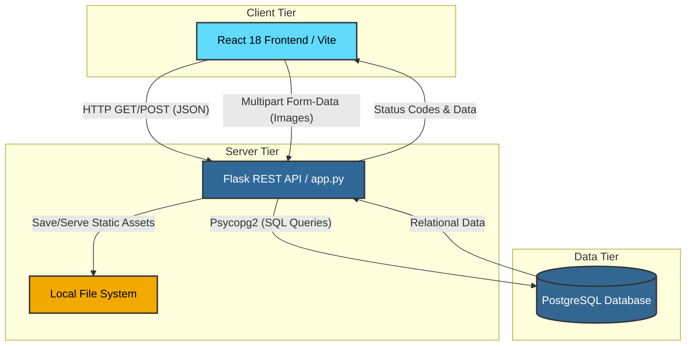

# Turf Arena

> [**Click Here to Watch the Full Turf Arena Demo Video!**](https://drive.google.com/file/d/1icKnvmVfAbSoohN3mosa5Qt2aCqisLZB/view?usp=sharing)

Turf Arena is a full-stack, turf-management and booking application built to solve coordination overhead, eliminate scheduling conflicts, and optimize court utilization for turf operators and players. 

The application implements strict role-based access controls, automated invoice generation, real-time availability matrices, and a custom state-driven user interface.

## System Architecture and Tech Stack

The platform is engineered using a decoupled client-server architecture:



* **Frontend:** React 18, Vite, Custom CSS (State-driven UI architecture minimizing virtual DOM overhead).
* **Backend:** Python, Flask, RESTful API design patterns.
* **Database:** PostgreSQL (Relational mapping with transactional integrity and relational foreign key constraints).
* **Storage:** Local multipart form-data file system routing for asset management.

## Core Engineering Features

### 1. State-Driven Modal Architecture
Replaced all legacy native synchronous browser routing blocks (window.prompt, window.confirm, window.alert) with custom, asynchronous React state overlays. The user experience remains seamless without freezing the main browser thread during transactions, cancellations, or administrative pricing updates.

### 2. Form-Data Multi-Part Streams
Implemented multi-part form data ingestion in the Flask API layer to handle simultaneous payload delivery of text attributes (location, pricing, court types) and binary assets (venue images), mapping target storage paths directly to relational database rows.

### 3. Cascade Database Deletions
Engineered a secure data purge lifecycle using PostgreSQL-compatible backend transactions. Admin turf deletion automatically evaluates dependencies, scrubbing associated reservation records first to protect relational integrity and avoid database lockouts or deadlocks.

### 4. Interactive Third-Party Integrations
Embedded contextual external deep links (Google Maps API integration) and public data parameters directly into data object renderings based on location strings stored in the relational schema.

---

## Production Setup and Installation

### Prerequisites
* Node.js (v18 or higher)
* Python 3.10+
* PostgreSQL instance running locally or hosted

### 1. Database Initialization
Execute the underlying SQL schema initialization scripts inside your PostgreSQL instance to generate the relational structure:

```sql
CREATE TABLE Turf (
    turfid SERIAL PRIMARY KEY,
    turfname VARCHAR(255) NOT NULL,
    type VARCHAR(100) NOT NULL,
    location VARCHAR(255) NOT NULL,
    priceperhour NUMERIC NOT NULL,
    image_url TEXT,
    google_maps_link TEXT,
    contact_email VARCHAR(255),
    adminid INT
);

CREATE TABLE booking (
    bookingid SERIAL PRIMARY KEY,
    userid INT,
    turfid INT REFERENCES Turf(turfid),
    bookingdate DATE NOT NULL,
    timeslot VARCHAR(50),
    duration INT DEFAULT 1,
    totalamount NUMERIC NOT NULL,
    status VARCHAR(50) DEFAULT 'Confirmed'
);
```

### 2. Environment Variables Configuration
To decouple system credentials from source control, establish a secure environment file in the backend root directory.

Create a `.env` file:
```text
DB_PASSWORD="your_secure_postgres_password"
```

Ensure the `.env` configuration is explicitly declared in your `.gitignore` file before running upstream commits.

### 3. Backend (Flask) Ingestion Pipeline
```bash
cd backend
python -m venv venv

# Windows execution
venv\Scripts\activate

# Unix/macOS execution
source venv/bin/activate

pip install -r requirements.txt
python app.py
```

### 4. Frontend (React/Vite) Runtime Environment
```bash
cd frontend
npm install
npm run dev
